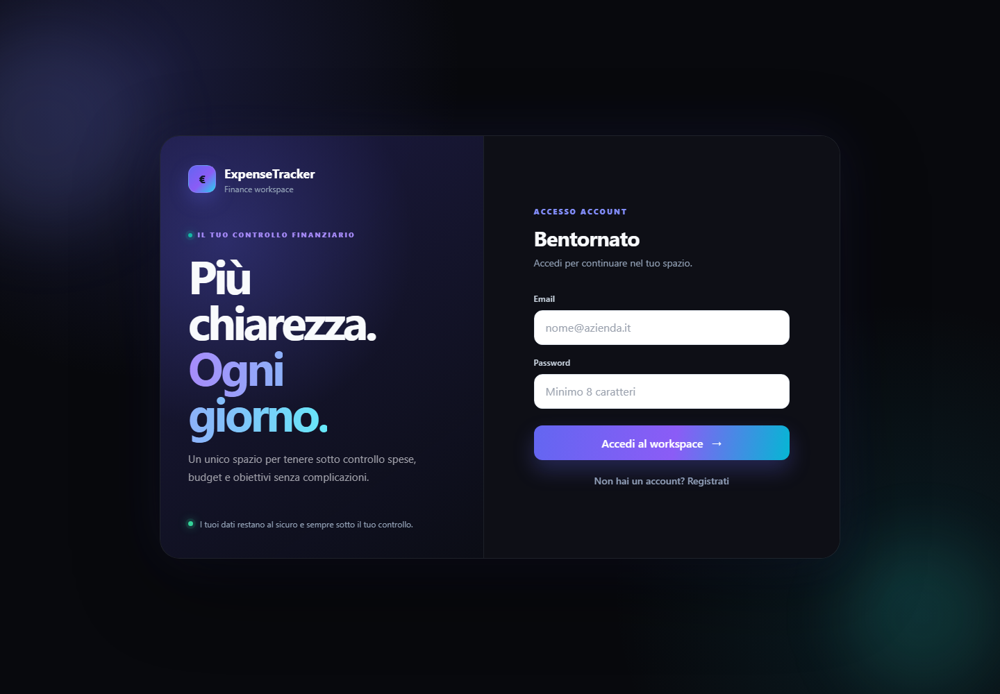
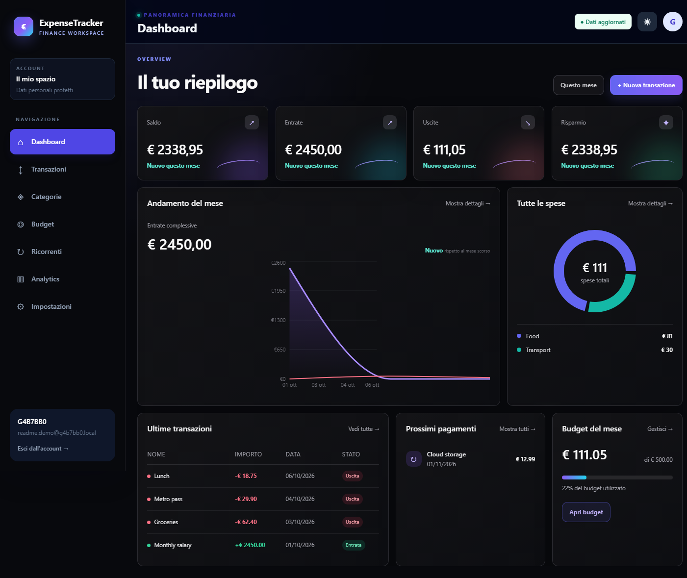
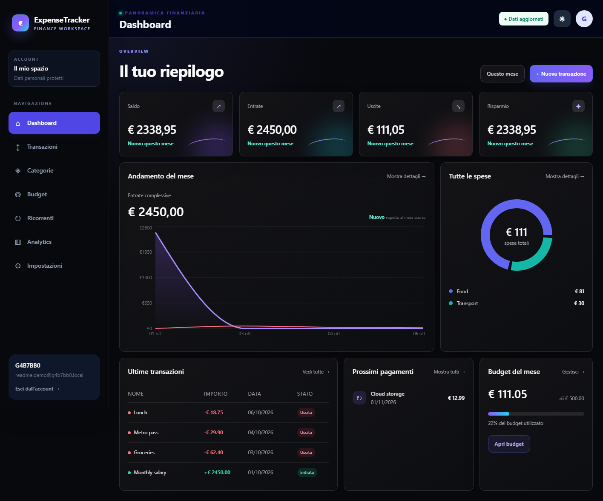
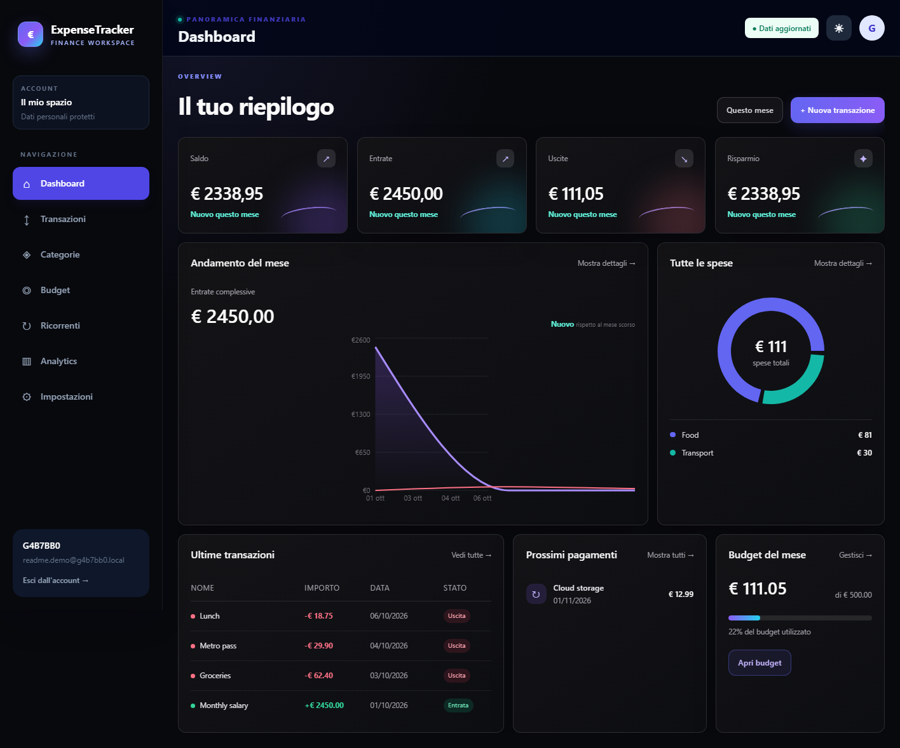

# ExpenseTracker

ExpenseTracker is a simple Windows desktop app for keeping track of personal money.

Add your income and expenses, see where your money goes, set a monthly budget, and keep recurring payments in one place.

> **Project status: finished**
>
> Built and completed by **G4B7BB0** using a vibe-coding workflow.


## What it does

- Shows your current balance, income, expenses, savings, and budget progress
- Lets you add, edit, filter, and remove transactions
- Organises transactions with custom categories
- Supports monthly budgets
- Keeps recurring payments visible
- Includes charts for monthly and category spending
- Imports and exports transactions as CSV files
- Supports light mode and dark mode
- Stores data locally on the Windows computer

## Screenshots

### Login and account workspace



### Dashboard



### Transactions



### Analytics



## Technology used

- React and TypeScript for the interface
- Node.js and Express for the local API
- Electron for the Windows desktop app
- SQLite and Prisma for local data
- Recharts for the graphs

## Run it on your computer

You need Windows, Node.js 20 or newer, and npm.

```bash
git clone https://github.com/G4B7BB0/ExpenseTracker.git
cd ExpenseTracker
npm install
npm install --prefix client
npm install --prefix server
npm run dev
```

Then open `http://localhost:5173`.

To create a Windows build:

```bash
npm run build:installer
```

The installer is generated in the `release` folder.

## Your data

ExpenseTracker uses a local SQLite database. It does not need PostgreSQL, a cloud account, or another external service.

The desktop database is stored here:

```text
%APPDATA%\expense-tracker\data
```

Do not commit `.env` files, database files, `node_modules`, or generated builds.

## Personal-use notice

This repository is shared so people can **clone it and use it personally**.

There is **no permission to republish, redistribute, sell, rebrand, or upload modified copies** of this project or its assets. Please keep the original author information and do not present the project as your own.

See [`LICENSE.md`](LICENSE.md) for the full personal-use notice.
